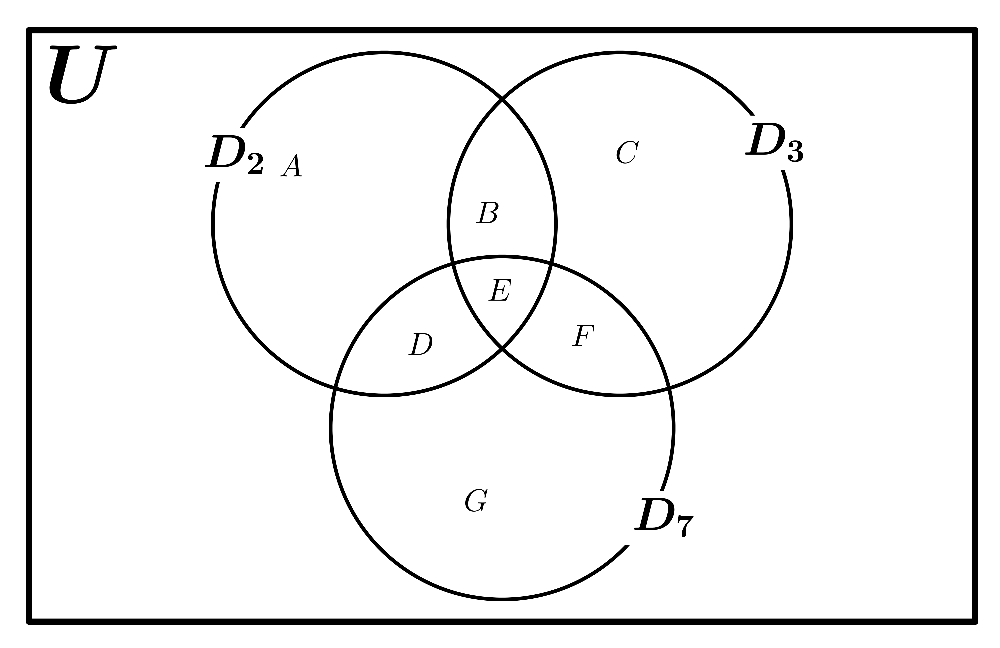

+++
date = 2024-07-24T18:09:49-08:00
title = 'JEE Problem'
slug = 'jee237'
summary='Find the number of 3 digit natural numbers from that are divisible by 2 or 3 but not by 7.'
categories = ['Tech']
tags = ['maths' ]
[params]
  math = true
+++

## Problem 
Find the number of 3 digit natural numbers from that are divisible by 2 or 3 but not by 7. 

## Solution

Let the set U be the 3 digit numbers (i.e. numbers from 100 to 999, both numbers inclusive). Let the sets \(D_2\), \(D_3\) and \(D_7\) be subsets of U such that they are the sets of numbers divisible by 2, 3 and 7 respectively. This is illustrated in the following figure. 

Let A, B, C, D, E, F and G be the cardinality of the set of of numbers in various mutually exclusive parititions of the set \(D_2\), \(D_3\) and \(D_7\) as marked in the figure. 

The solution of the said problem is to find \(A + B + C\). We define the following:

\[ x_2 = n(D_2) \]
\[ x_3 = n(D_3) \]
\[ x_7 = n(D_7) \]
\[ x_{23} =  n(D_2 \cap D_3) \]
\[ x_{27} =  n(D_2 \cap D_7) \]
\[ x_{37} =  n(D_3 \cap D_7) \]
\[ x_{237} =  n(D_2 \cap D_3 \cap D_7) \]

By definition,
\[ B + E   = x_{23} \]
\[ D + E  = x_{27} \]
\[ E + F  = x_{37} \]
\[ A + B + D + E  = x_2 \]
\[ B + C + E + F = x_3 \]
\[ D + E + F + G  = x_7 \]
\[ E  = x_{237} \]

Thus, we have:

\[ A + B + C = (A + B + D + E - D - E) + (C + B + E + F - B - E - F) \]
\[ = (x_2 - D - E) + (x_3 - B - E - F) \]
\[ = (x_2 - (D + E - E) - E) + (x_3 - B - E - F) \]
\[ = (x_2 - (x_{27} - E) - E) + (x_3 - B - E - F) \]
\[ = x_2 - x_{27}  + (x_3 - B - E - F) \]
\[ = x_2 - x_{27}  + (x_3 - (B + E - E)  - E - (F + E - E))) \]
\[ = x_2 - x_{27}  + (x_3 - (x_{23} - E)  - E - (x_{37} - E)) \]
\[ = x_2 - x_{27}  + (x_3 - (x_{23} - x_{237})  - x_{237} - (x_{37} - x_{237})) \]
\[ = x_2 + x_3 - x_{27} - x_{23}  - x_{37} + x_{237}   \]

Now, we find the values of \(x_2, x_3, x_{23},  x_{27}, x_{37},\) and \(x_{237}\).

The numbers in U that are divisible by 2 are:
100, 102, 104 ... 998. This is an A.P. that starts from 100 with difference of 2 between successive terms. Hence, \(100 + 2(x_2 - 1) = 998\). Therefore, \(x_2 = 450\).

The numbers in U that are divisible by 3 are:
102, 105, 108 ... 999. This is an A.P. that starts from 102 with difference of 3 between successive terms. Hence, \(102 + 3(x_3 - 1) = 999\). Therefore, \(x_3 = 300\).

The numbers in U  that are divisible by 2 and 3 (i.e \(2\times 3=6\)) are:
102, 108, 114 ... 996. This is an A.P. that starts from 102 with difference of 6 between successive terms. Hence, \(102 + 6(x_{23} - 1) = 996\). Therefore, \(x_{23} = 150\).

The numbers in U   that are divisible by 2 and 7 (i.e \(2 \times 7 = 14\)) are:
112, 126, ... 994. This is an A.P. that starts from 112 with difference of 14 between successive terms. Hence, \(112 + 14(x_{27} - 1) = 966\). Therefore, \(x_{27} = 64\).

The numbers in U that are divisible by 3 and 7 (i.e \(3\times 7=21\)) are:
105, 126, ... 987. This is an A.P. that starts from 105 with difference of 21 between successive terms. Hence, \(105 + 21(x_{37} - 1) = 987\). Therefore, \(x_{37} = 43\).

The numbers in U  that are divisible by 2, 3 and 7 (i.e \(2 \times 3 \times 7 = 42\)) are:
 126, (126 + 42) ...  966. This is an A.P. that starts from 126 with difference of 42 between successive terms. Hence, \(126 + 41(x_{237} - 1) = 966\). Therefore, \(x_{237} = 21\).

Substituting the values : \(A + B + C = x_2 + x_3 - x_{23} - x_{27} - x_{37} + x_{237}\) we get \( A + B + C = 450 + 300 - 150 - 64 - 43 + 21 = 514\). Thus, the answer is 514.

