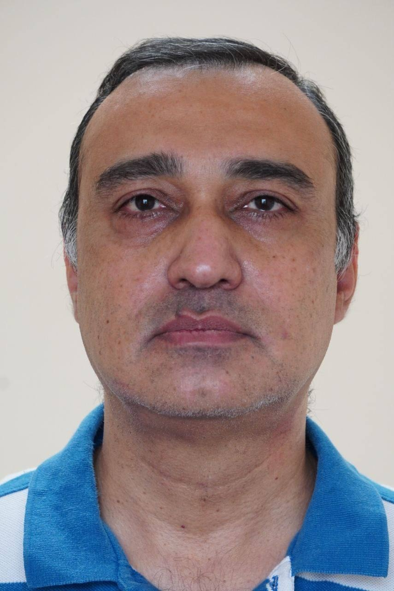

+++

title = 'About Me'
slug = 'about'
summary='About Sandeep Nangia.'
date=2024-07-25T12:05:00+05:30
+++

I have a M.Tech degree in Computer Science & Engineering from [IIT Kanpur](www.iitk.ac.in/) and a Bachelor’s of Engineering again in Computer Science & Engineering from Punjab Engineering College (now renamed to [PEC University of Technology](http://pec.ac.in/), a deemed university). You can read more about my professional profile on [LinkedIn](http://in.linkedin.com/in/sandeepnangia).

I intend to blog here on the things that interest me like:

- Indian Culture: specifically [Saṃskṛta](http://en.wikipedia.org/wiki/Sanskrit) and various [Stotras](http://en.wikipedia.org/wiki/Stotra) or other titbits from Sanskrit or other Indian culture related literature. 
- Programming problems solved just for fun (usually in [Clojure](http://clojure.org/) or [Python](http://www.python.org/)).
- Maths Problems just solved for fun. 
- Technology

I studied Saṃskṛta till class 12th and then, off and on, I have kept in touch with it. The topic of my Master’s dissertation was “Sandhi Analysis using Two-Level Morphology” where I tried to apply Finite State Transducers to the problem of Sandhi Analysis. I have been doing a little bit of service at [Sri Ma Trust](http://www.kathamrita.org) and that has allowed me to keep in touch with Sanskrit over the years. And then, sometime back, I found friends who were avid Saṃskṛta enthusiasts and that has kindled a new interest in Saṃskṛta. 

Credits
-------
This site has been created with the [Hugo](https://gohugo.io), a [Go](https://go.dev) based static blog generator. The theme used is [Hugo-Octpress](https://themes.gohugo.io/themes/hugo-octopress/).
